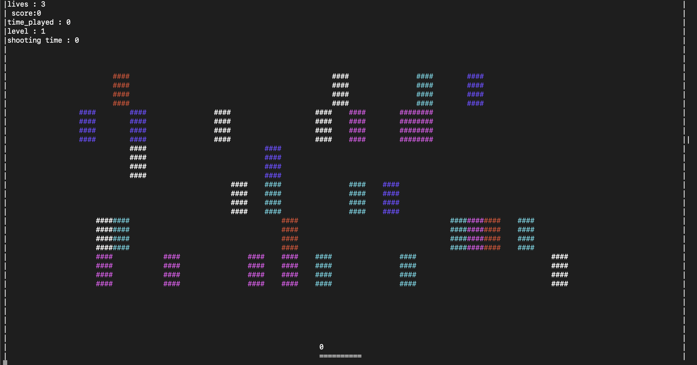
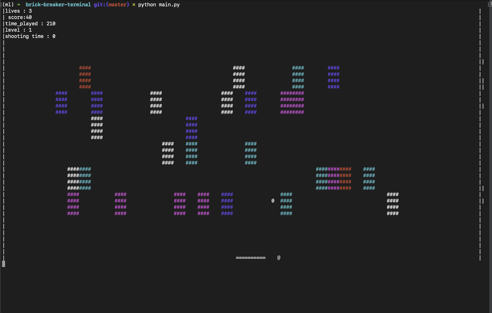

# brick breaker terminal

This is a terminal version of the game breakout, made in python.

## How To Run

- First you install required dependancies
    ```terminal
    $ pip install -r requirements.txt
    ```

- Then you run the code
    ```terminal
    python main.py
    ```

## Controls

`a` - move paddle left

`d` - move paddle right

`p` - start the game (when new map starts) and to pause and unpause the game

`r` - to release ball from paddle when the paddle lock power up is active

`q` - quit the game

`s` - restart game after gameover

`l` - go to next level

## Features

### Inheritance
<b>playState, pauseState and quitState</b> all inherit from baseState

### Polymorphism
<b>playState, pauseState and quitState</b> all overwrite some functions of baseState

### Encapsulation
Classes and objects exist

### Abstraction
Almost everything is abstracted, like handling ball movement and removing of bricks

## Screenshots


